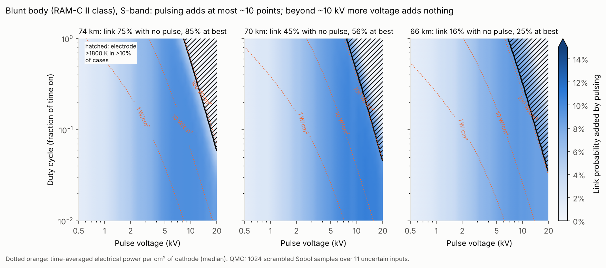
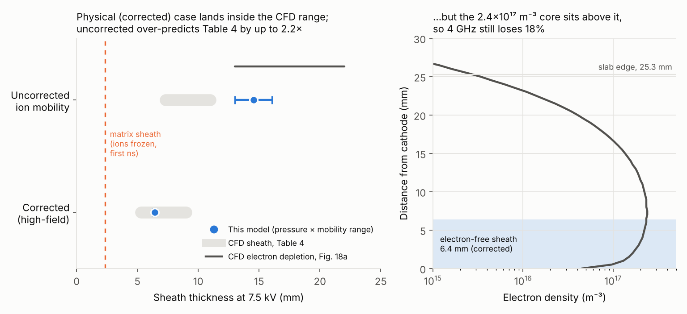
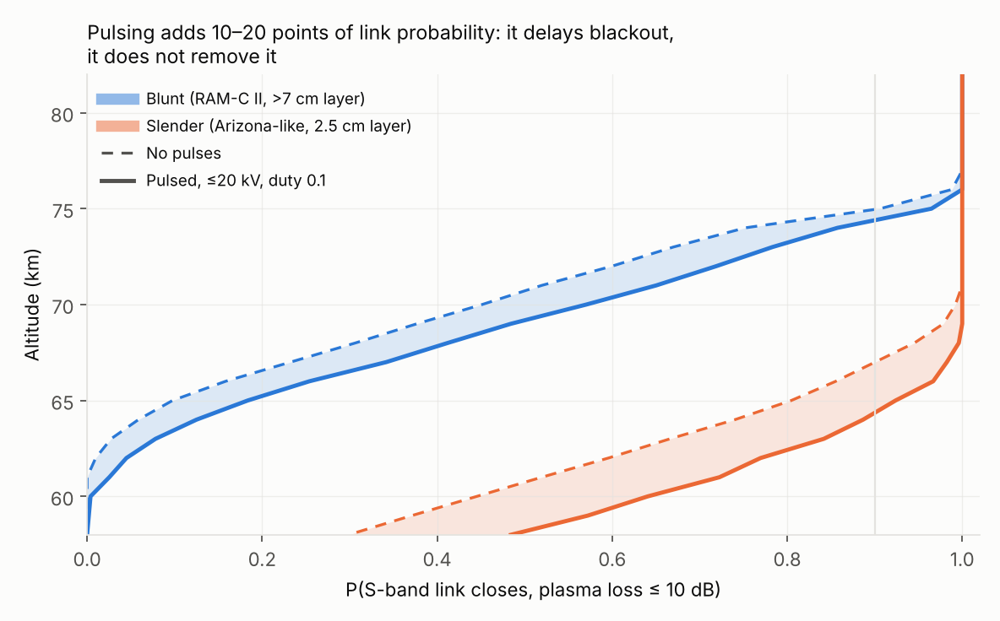
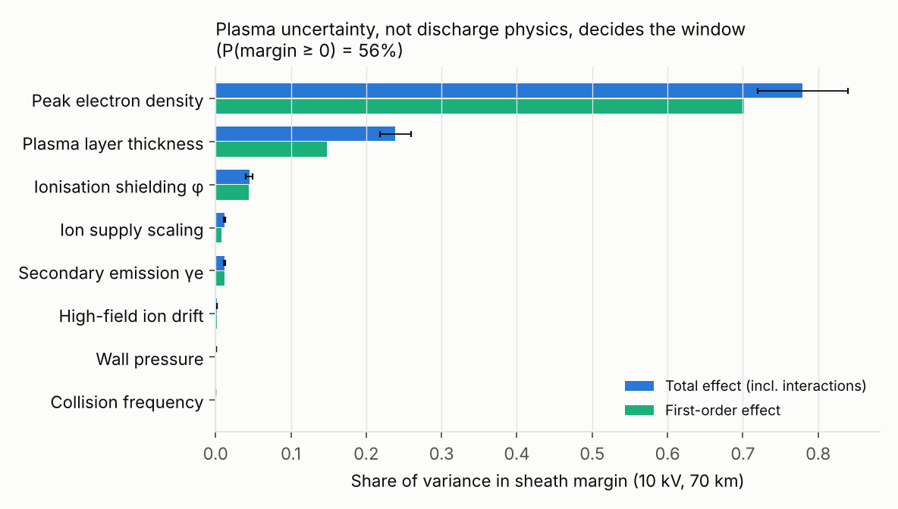
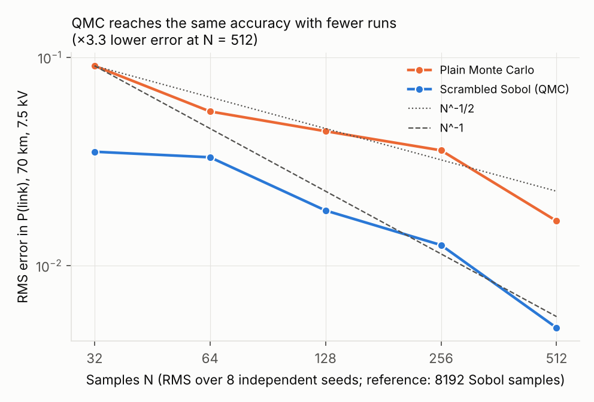

# Re-entry Blackout Window

**Where, at what cost, and with what confidence can pulsed electric fields restore radio contact through a re-entry plasma?**

During re-entry the shock layer ionises and blocks radio links, known as a "blackout". A large negative voltage pulse on a surface electrode can push electrons out of a region above an antenna and open a window. Recent coupled CFD (Rodríguez Fuentes & Parent, 2026) showed this at one flight condition, and particle simulations (Krishnamoorthy & Close, 2017) showed it in collisionless plasma over nanoseconds. This project builds a fast reduced-order model, validates it against that CFD and against the RAM-C II flight data, and maps the whole design space with quasi-Monte Carlo uncertainty quantification.



## Findings

- **Pulsing delays blackout; it does not remove it.** For a blunt RAM-C II-class body at S-band, pulses add at most 13 percentage points of link probability. They move the 50% link altitude from 70.7 to 69.2 km. For a slender body with a thin plasma layer they add up to 20 points, moving the same point from 60.7 to 58.2 km.
- **Depth, not heat or power, is the limit.** The electron-free sheath reaches 5–15 mm, but at the blackout peak the overdense layer is several centimetres thick. At 70 km and 7.5 kV the cathode adds 11 W/cm² of heating to 15 W/cm² of aerodynamic heating, so nominally the electrode stays below 1550 K even with the pulse always on. The current is 200× below the glow-to-arc threshold. Heating only binds above about 100 W/cm² average electrical power (hatched region).
- **More voltage stops helping beyond about 10 kV.** The cathode current rises roughly as V², so ionisation inside the sheath adds shielding as fast as voltage adds depth. How strongly depends on where those ions are created (φ). This is the main physics unknown, and the current scaling is extrapolated above the 7.5 kV calibration point.
- **What decides the window is the plasma, not the discharge.** Sobol indices put 78% of the variance in sheath margin on the peak electron density and 24% on layer thickness. Discharge physics accounts for under 7% in total: ionisation shielding 5%, secondary emission and ion supply 1% each. Better re-entry plasma prediction matters more than better discharge modelling.
- **The cost is small.** Nominally at 70 km, 7.5 kV with a 5% duty cycle averages 5.9 W/cm² of cathode. That is about 290 W for a 50 cm² electrode, or a few Wh over a RAM-C II-length blackout.

## Method

Everything runs in seconds per flight condition, so 10,000-sample sensitivity studies take about a minute.

| Module | Physics | File |
|---|---|---|
| Plasma and propagation | Cold collisional plasma; exact 1D multilayer transfer matrix (includes reflection) | `plasma.py`, `propagation.py` |
| Sheath | Matrix sheath; steady collisional sheath with high-field ion drift v = K√(E/N), integrated exactly over the real gas-density profile (matches the ODE solver to 0.01%) | `sheath.py` |
| Current closure | J = c_s·e·n₀·u_B·[1 + g(γe)(V/V_m)^m], calibrated on the Arizona I–V curve (2.9% RMS); γe dependence from their Fig. 18b | `closure.py` |
| Flight condition | US76 atmosphere, RAM-C II trajectory, station-3 peak density, Arizona profile shape stretched to the RAM-C aft layer (>7 cm) | `atmosphere.py`, `window.py` |
| Limits | Electrode radiative-equilibrium temperature (aero + ion impact at Wannier energy + neutralisation), glow-to-arc current density, average power | `window.py` |
| Uncertainty | Scrambled Sobol sequences over 11 inputs; Saltelli/Jansen Sobol indices with bootstrap intervals | `uq.py`, `analysis/` |

Quasi-steady square pulses are justified by the timescales at 70 km. The sheath forms in about 0.1 µs (ion transit) and settles within the 10 µs flow residence time. It collapses in about 20 ns when electrons return, so pulses longer than about 50 µs give a window lasting the whole pulse.

### Uncertain inputs (uniform ranges)

| Input | Range | Basis |
|---|---|---|
| Peak electron density | ×0.5–2 | RAM-C II reflectometer error bar |
| Layer thickness | 2–4× Arizona shape (5–10 cm) | RAM-C II probe rake: aft layer >7 cm |
| Wall pressure coefficient | 0.04–0.08 | 9° cone, hypersonic |
| High-field ion drift constant | ±20% | Sinnott et al. data scatter |
| Secondary emission γe | 0.1–0.5 | Arizona sensitivity range |
| Ion supply scaling c_s | ×0.5–1.5 | Single calibration point |
| Ionisation shielding φ | 0–1 | Bounds: Arizona 5→7.5 kV growth sits between |
| Collision cross-section | ×0.5–2 | Hard-sphere estimate |
| Ion energy accommodation | 0.25–1 | Wannier energy, surface physics |
| Aft/stagnation heating ratio | 0.05–0.12 | Laminar cone distributions |
| Glow-to-arc current density | 10⁴–10⁵ A/m² | Glow discharge literature |

## Validation

| Case | Source | Result |
|---|---|---|
| V1 plasma layer | RAM-C II, NASA TN D-6062 | Data rebuilt; altitudes cross-checked to 0.34 km. Modelled S-band blackout onset ≈71 km vs reflectometer cut-off at 74 km |
| V2 attenuation | Arizona 2026, Table 4 | **Pass**: 6 points within 3.7% |
| V3 sheath and window | Arizona 2026, 7.5 kV | **Pass**: 6.1–6.6 mm vs CFD 5.3–9 mm; mobility trend ×0.44 ("two- or three-fold"); plasma above sheath 1.21×10¹⁷ vs 1.14×10¹⁷ m⁻³ |
| Current closure | Arizona 2026, Fig. 16 | 2.9% RMS; reproduces 7.5 kV current and γe sweep |
| QMC | This work | ×3.3 lower error than plain Monte Carlo at 512 samples |



Further results:
- **Arizona's Eq. (18) appears to contain a typo.** As typeset (ω_p⁴), it does not reproduce their own Table 4; the standard ω_p²ω² form does.
- **Averaging the plasma into a uniform slab overstates the window.** Near the plasma frequency, a slab of the same mean density gives 99.9% transmission at 4 GHz where the real profile gives 82%.





## Limitations

- **One calibration point.** The current closure comes from one CFD condition (68 km, sharp wedge). Scaling with density, temperature and voltage above 7.5 kV is physics-based but unvalidated, so it is carried as uncertainty.
- **Assumed profile shape.** The RAM-C aft profile reuses the Arizona shape stretched to >7 cm, and peak density is interpolated from three reflectometer points. One of them (X-band, 52 km) is low confidence. Dropping it raises densities below 70 km by 2–5×, which would make pulsing less effective, so the findings above are if anything optimistic.
- **Steady-state heating.** Electrode temperature uses steady radiative equilibrium, which is conservative for a short blackout. Gas heating is reported only as an upper bound that ignores heat losses, and is not used as a limit. Edge hot spots seen in the CFD at high γe are not modelled (1D).
- **Single antenna and electrode.** One planar electrode pair; no magnetic field, multi-electrode arrays or insulated-electrode charging (Krishnamoorthy & Close).

## Repository layout

```
src/blackout/     plasma, propagation, sheath, closure, atmosphere, window, uq
data/             RAM-C II tables (build_ramc2.py) and digitised Arizona CFD data (arizona2026/)
validation/       v2_arizona_table4.py, v3_arizona_7p5kV.py
analysis/         run_analysis.py (trajectory, slender, maps, sobol, convergence, costs), make_figures.py
tests/            33 physics, validation and regression tests (unittest; pytest compatible)
figures/          generated plots
```

## Run it

```bash
pip install -r requirements.txt
python data/build_ramc2.py && python data/plot_ramc2.py
python validation/v2_arizona_table4.py && python validation/v3_arizona_7p5kV.py
python analysis/run_analysis.py          # about 8 minutes on a laptop
python analysis/make_figures.py
python -m unittest discover -s tests     # or: pytest
```

## Key references

1. Rodríguez Fuentes, F. M. & Parent, B. (2026). Electron density depletion in reentry plasma flows using pulsed electric fields. *Physics of Fluids* 38(3), 036114. [arXiv:2512.18163](https://arxiv.org/abs/2512.18163)
2. Krishnamoorthy, S. & Close, S. (2017). Investigation of plasma–surface interaction effects on pulsed electrostatic manipulation for reentry blackout alleviation. *J. Phys. D* 50, 105202. Their particle simulations are collisionless and nanoseconds long; they note that surrogate models and smart sampling are needed to map the design space, which is what this project does.
3. Keidar, M., Kim, M. & Boyd, I. D. (2008). Electromagnetic reduction of plasma density during atmospheric reentry and hypersonic flights. *J. Spacecraft Rockets* 45(3), 445–453.
4. Grantham, W. L. (1970). Flight results of a 25,000 ft/s reentry experiment using microwave reflectometers. NASA TN D-6062. [NTRS](https://ntrs.nasa.gov/citations/19710004000)
5. Saltelli, A. et al. (2010). Variance based sensitivity analysis of model output. *Computer Physics Communications* 181, 259–270.

## Author

Adam Williams, MEng Aeronautical & Astronautical Engineering, University of Southampton.
